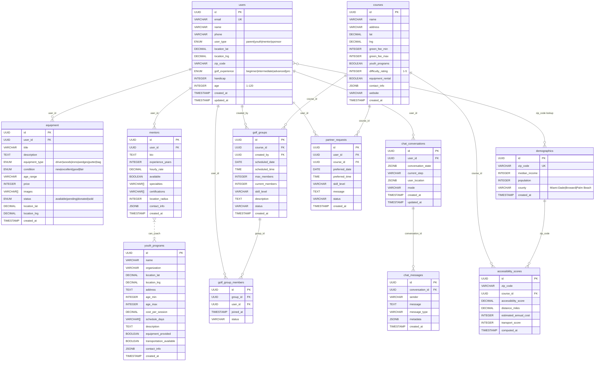

# EquiTee Database ERD

## Current Database Schema (Supabase)

## Table Descriptions

### Core Tables (Existing)
- **users**: Core user accounts for all platform participants
- **courses**: Golf courses in South Florida with pricing and amenities
- **equipment**: Golf equipment marketplace (buy/sell/donate)

### Data Tables (Added via Migrations)
- **demographics**: US Census data by ZIP code for accessibility analysis
- **youth_programs**: Youth golf programs (First Tee, municipal, etc.)
- **mentors**: Golf instructors and coaches linked to user accounts

### Community Features (Day 2 Spec)
- **golf_groups**: Organized golf groups for scheduled rounds
- **golf_group_members**: Members in each golf group
- **partner_requests**: Users seeking golf partners at specific courses
- **accessibility_scores**: Computed accessibility data for heat map

### AI Chat System
- **chat_conversations**: User chat sessions with AI golf coach
- **chat_messages**: Individual messages within conversations

## Key Relationships

1. **users** → **equipment, mentors, golf_groups, partner_requests, chat_conversations**: One user can have multiple of each
2. **courses** → **golf_groups, partner_requests, accessibility_scores**: Courses are central to community and analysis features
3. **golf_groups** → **golf_group_members**: Group membership tracking
4. **chat_conversations** → **chat_messages**: Message history within conversations
5. **demographics** → **accessibility_scores**: Census data drives accessibility calculations

## Current Data Counts

- **Demographics**: 143 ZIP codes with real Census data (loaded)
- **Youth Programs**: 6 verified programs in South Florida (loaded)
- **Mentors**: 13 verified PGA pros and First Tee coaches (loaded)
- **Users**: Existing user base + 13 mentor accounts
- **Courses**: Existing golf course data
- **Equipment**: Existing equipment listings
- **Community Tables**: Ready for implementation
- **Chat Tables**: Ready for AI agent development

## Data Sources

- **Demographics**: US Census Bureau 2022 ACS (real data)
- **Youth Programs**: First Tee, municipal programs (verified)
- **Mentors**: PGA professionals, First Tee coaches (verified)

## Migration Status ✅

All database migrations completed successfully:
- ✅ **001_create_core_tables.sql**: Community and chat tables created
- ✅ **002_create_indexes.sql**: Performance indexes applied
- ✅ **003_seed_demographics_data.sql**: 143 ZIP codes loaded
- ✅ **004_seed_youth_programs.sql**: 6 programs loaded
- ✅ **005_seed_mentors.sql**: 13 mentors loaded
- ✅ **006_create_spatial_functions.sql**: Location functions ready

## Available Spatial Functions

- `find_youth_programs_nearby(lat, lng, max_distance, max_cost, min_age, max_age)`
- `find_mentors_nearby(lat, lng, max_distance, max_hourly_rate)`
- `find_courses_nearby(lat, lng, max_distance, max_green_fee, youth_programs_only)`
- `find_equipment_nearby(lat, lng, max_distance, max_price, equipment_type_filter)`

## Ready for API Development

Database is fully prepared for:
1. **Community Features**: Golf groups, partner matching
2. **AI Chat Agent**: Conversation management with spatial queries
3. **Accessibility Analysis**: Demographics + course data computation
4. **Mentor Matching**: Real professional data with location filtering